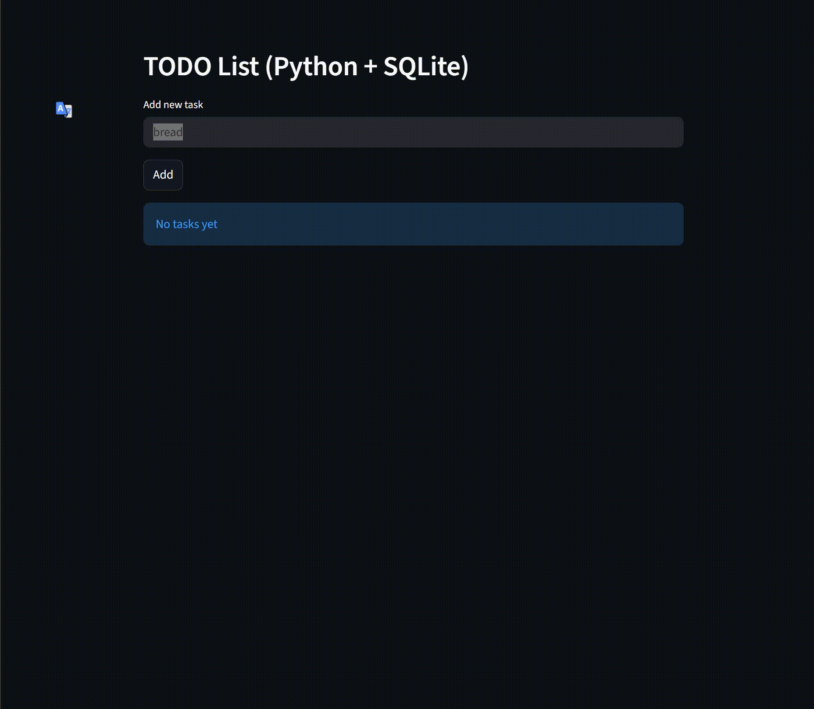

# 📌 TO-DO List — Python + SQLite + Streamlit

  

  
 👇👇👇👇👇👇👇👇👇👇

  
  
 ☝️☝️☝️☝️☝️☝️☝️☝️☝️☝️

---

# 🧾 Project Overview

This project is a simple and clean **To-Do List Web App** built with:

- **Streamlit** — user interface & web interaction  
- **SQLite** — lightweight database for task storage  
- **Virtual task numbering** — independent from the database ID (always 1..N)

It is designed as a:

- learning project  
- GitHub portfolio example  
- easy template for your own apps  

---

# ✨ Features

✔ Add new tasks  
✔ Virtual numbering (1..N), not tied to SQLite IDs  
✔ Delete tasks by their displayed number  
✔ Automatic re-indexing after deletion  
✔ Tasks stored in SQLite  
✔ Simple clean UI with Streamlit  

---

# 🎬 Demo Video

---
